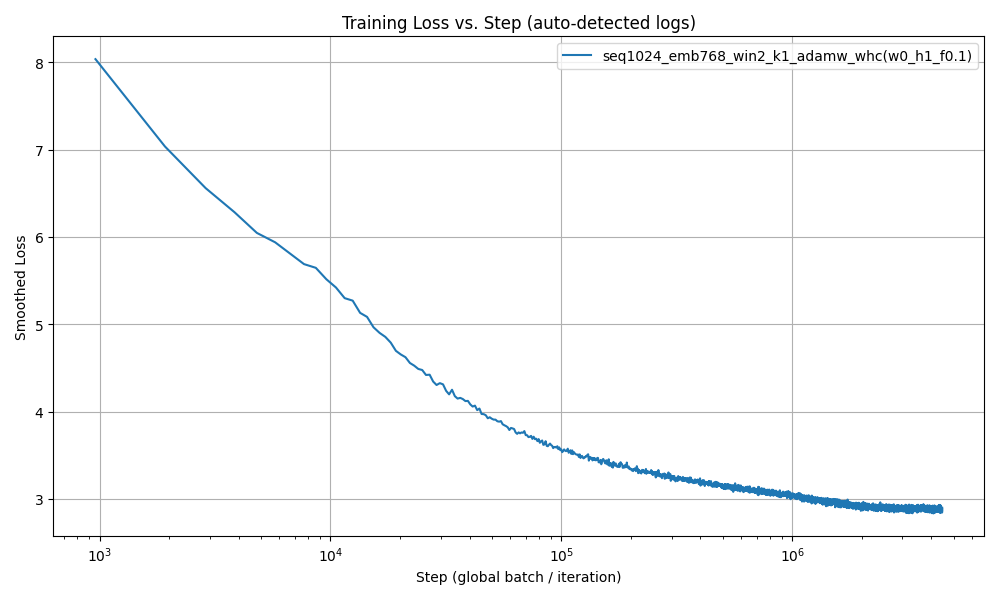

# Causal Convolution Transformer (CCT)

CCT is a compact GPT-2–style language model that adds a **causal convolution residual path** to each transformer block.  
This repo contains a minimal, production-ready training pipeline:

- ✅ CPU/GPU auto-detection (AMP on CUDA)  
- ✅ Two datasets out of the box:  
  - **`tiny`** – tiny Shakespeare (character-level)  
  - **`openwebtext`** – via 🤗 Datasets + GPT-2 BPE  
- ✅ One-command **train / resume / validate / sample**  
- ✅ No package install required; run with `python -m scripts.*`

---

## Contents

```
cct/
  __init__.py
  checkpoint.py
  data.py
  download_data.py
  model.py
  optim.py
  tokenizer.py
scripts/
  train.py
  validate.py
  sample.py
requirements.txt
README.md
```

---

## Environment

### 1) Create venv

```bash
python3 -m venv .venv
source .venv/bin/activate
python -V
```

### 2a) CPU-only (simplest)

```bash
pip install -r requirements.txt
```

### 2b) GPU (CUDA) build of PyTorch

Pick the wheel that matches your NVIDIA driver (`nvidia-smi`).

**CUDA 12.1:**
```bash
pip install --index-url https://download.pytorch.org/whl/cu121 torch torchvision torchaudio
pip install transformers datasets matplotlib pandas requests tqdm
```

**CUDA 12.4:**
```bash
pip install --index-url https://download.pytorch.org/whl/cu124 torch torchvision torchaudio
pip install transformers datasets matplotlib pandas requests tqdm
```

Verify:

```bash
python - <<'PY'
import torch
print("torch", torch.__version__)
print("cuda available:", torch.cuda.is_available())
if torch.cuda.is_available():
    print("device:", torch.cuda.get_device_name(0))
PY
```

---

## Quickstart

### Tiny Shakespeare (fastest)

**Train (fresh):**
```bash
python -m scripts.train --dataset tiny --data-dir data/tiny --tag tiny_demo   --epochs 2 --seq-length 256 --n-embd 128 --n-layer 4 --n-head 4   --batch-size 16 --accum-steps 1 --lr 3e-4 --use-scheduler --grad-clip 1.0
```

**Resume +2 epochs:**
```bash
python -m scripts.train --dataset tiny --data-dir data/tiny --tag tiny_demo   --resume tiny_demo --epochs-add 2 --use-scheduler --accum-steps 1
```

**Validate:**
```bash
python -m scripts.validate --ckpt checkpoints/tiny_demo/epoch4.pt --data-dir data/tiny
```

**Sample:**
```bash
python -m scripts.sample --ckpt checkpoints/tiny_demo/epoch4.pt --data-dir data/tiny   --seq-length 256 --prompt "To be, or not to be,"   --temperature 0.8 --top-k 50 --top-p 0.9 --max-new-tokens 200
```

### OpenWebText (subset first, then scale)

**1% subset smoke test:**
```bash
python -m scripts.train --dataset openwebtext --subset 'train[:1%]'   --data-dir data/owt_1pct --tag owt_1pct   --epochs 1 --seq-length 256   --n-embd 256 --n-layer 6 --n-head 8   --batch-size 8 --accum-steps 1 --lr 3e-4   --use-scheduler --grad-clip 1.0
```

**Validate:**
```bash
python -m scripts.validate --ckpt checkpoints/owt_1pct/epoch1.pt --data-dir data/owt_1pct
```

**Sample:**
```bash
python -m scripts.sample --ckpt checkpoints/owt_1pct/epoch1.pt --data-dir data/owt_1pct   --prompt "The purpose of life is" --max-new-tokens 120 --temperature 0.9 --top-p 0.9
```

To run full OpenWebText, omit `--subset`. First pass will spend time tokenizing; subsequent runs reuse the saved `.bin` files.

---

## Results

Training the Causal Convolutional Transformer (CCT) with GPT-2-scale 85million parameters on OpenWebText reaches a validation loss of ~2.9 after 2 epochs.


